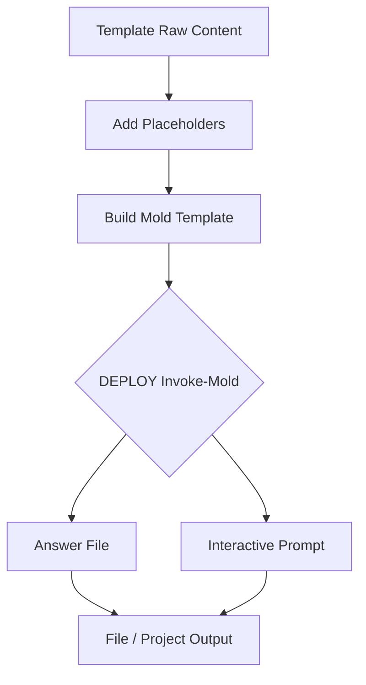

<div align="center" width="100%">
    <h1>Mold</h1><h4>📃 Effortless Templating with PowerShell 📃</h4>
    <p>Craft templates effortlessly, for any language, on any platform. Mold makes it happen! ✨</p><p>
    <a target="_blank" href="https://github.com/belibug"></a>
    <a target="_blank" href="https://GitHub.com/belibug/Mold/graphs/contributors/"></a><br>
    <a target="_blank" href="https://GitHub.com/belibug/Mold/commits/"></a>
    <a target="_blank" href="https://GitHub.com/belibug/Mold/issues/"></a>
    <a target="_blank" href="https://github.com/belibug/Mold/issues?q=is%3Aissue+is%3Aclosed"></a><br>
</div>
**MOLD**: Inspired by Plaster, the PowerShell template and scaffolding engine that lets you effortlessly craft templates for any language, on any platform. 🚀 Deploy in a flash with interactive prompts or answer files – your choice! ✨

[![Mold@PowerShell Gallery][BadgeIOCount]][PSGalleryLink]
![WorkFlow Status][WorkFlowStatus]

## Description

Mold operates on Mold Templates,which can be generated using Mold commands (that means you dont have to learn a new sytnax or deal with xml files)

## How MOLD Works ✨




##Features

* **New-MoldManifest:** Creates a `MoldManifest.json` file for a new Mold template, defining its metadata and parameters.
* **Update-MoldManifest:** Automatically updates an existing `MoldManifest.json` file to match the latest changes in the template.
* **Get-MoldTemplate:** Retrieves Mold templates from various sources, including local directories and path environment variable (MOLD_TEMPLATES). 
* **Invoke-Mold:** Executes a Mold template to generate a project or file.

## Roadmap

- [ ] Build PSData Extension logic just like `plaster`
- [ ] JSON Schema and validation

## Installation

**Install Module from PSGallery**
   ```powershell
   Install-Module -Name Mold
   ```

## Usage

### Creating a New Template

1. **Prepare your template files:**  Place all the files for your template in a dedicated directory.
2. **Create the manifest:**
   ```powershell
   New-MoldManifest -Path 'C:\path\to\your\template'
   ```
   You'll be interactively prompted to provide information about your template.

### Updating a Template

1. **Make changes to your template files.**
2. **Update the manifest:**
   ```powershell
   Update-MoldManifest -TemplatePath 'C:\path\to\your\template'
   ```

### Finding Templates

1. **Search by name:**
   ```powershell
   Get-MoldTemplate -Name 'MyTemplate'
   ```

2. **Search in a specific path:**
   ```powershell
   Get-MoldTemplate -TemplatePath 'C:\Templates' -Recurse
   ```

### Using a Template (Invoke-Mold)

Assuming you have a function `Invoke-Mold` in your module, you would use it like this:

```powershell
Invoke-Mold -TemplatePath 'C:\path\to\your\template'
# Or 
Invoke-Mold -Name 'MyTemplate'
```

### MOLD_SCRIPT

Advanced templates can be created by building your own logic in `MOLD_SCRIPT.ps1` in root directory of template. This function has full access to all variables/response collected during `Invoke-Mold` command. 

Sample file - MOLD_SCRIPT.ps1
```PowerShell
param($MoldData)
# Should start with param block to get all MOLD variables in key-value pair
New-Item $MoldData.FileNameResponse
```
- Script must be of exact name `MOLD_SCRIPT.ps1`
- Must be in root directory of templates
- Must have param block with $MoldData to accept parameter values
- Will be run at the end of `Invoke-Mold` command. Can modify only template files (done in isolation) and has no access to target directory.

## Advanced Usage

* **Environment Variables:**  Set the `MOLD_TEMPLATES` environment variable to specify additional directories to search for templates.

## Examples

```powershell
# Create a manifest for a new template
New-MoldManifest -Path 'C:\MyNewTemplate'

# Update a manifest
Update-MoldManifest -TemplatePath 'C:\MyExistingTemplate'

# Find a template by name
$template = Get-MoldTemplate -Name 'WebProjectTemplate'

# Use the template
Invoke-Mold -TemplatePath $template.TemplatePath
```

## Contributing

Contributions are welcome! Please feel free to submit issues or pull requests.

## License

This project is licensed under the [MIT License](./LICENSE).

[BadgeIOCount]: https://img.shields.io/powershellgallery/dt/Mold?label=Mold%40PowerShell%20Gallery
[PSGalleryLink]: https://www.powershellgallery.com/packages/Mold/
[WorkFlowStatus]: https://img.shields.io/github/actions/workflow/status/belibug/Mold/Tests.yml