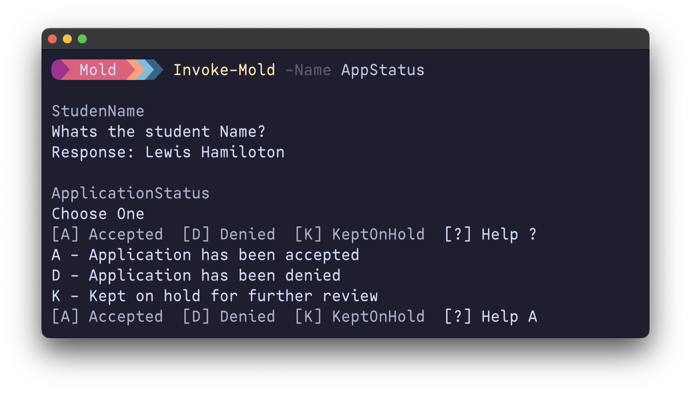
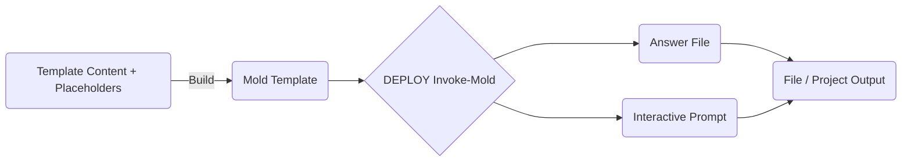

<div align="center" width="100%">
    <h1>Mold</h1><h4>📃 Effortless Templating with PowerShell 📃</h4>
    <p>Craft templates effortlessly, for any language, on any platform. Mold makes it happen! ✨</p><p>
    <a target="_blank" href="https://github.com/belibug"></a>
    <a target="_blank" href="https://GitHub.com/belibug/Mold/graphs/contributors/"></a><br>
    <a target="_blank" href="https://GitHub.com/belibug/Mold/commits/"></a>
    <a target="_blank" href="https://GitHub.com/belibug/Mold/issues/"></a>
    <a target="_blank" href="https://github.com/belibug/Mold/issues?q=is%3Aissue+is%3Aclosed"></a><br>
</div>
Inspired by [Plaster](https://github.com/PowerShellOrg/Plaster), Mold is PowerShell template & scaffolding engine that lets you effortlessly craft templates for any language, on any platform. 🚀 Deploy in a flash with interactive prompts or answer files – your choice!  

[![Mold@PowerShell Gallery][BadgeIOCount]][PSGalleryLink] ![WorkFlow Status][WorkFlowStatus]

## Description

Mold operates on Mold Templates,which can be generated using Mold commands (that means you dont have to learn a new sytnax or deal with xml files)

## 🧙‍♂️ Mold in Action

 Simply summon your template by name, answer questions based on template (or provide the answers upfront), and voilà! Your fully rendered files materialize right before your eyes. ✨



## **Installation:**

Get the Mold module from the [PowerShell Gallery][PSGalleryLink].

```powershell
Install-Module -Name Mold
```

### Deploy a Sample template

```powershell
# Invoke built in sample template
Invoke-Mold -Name AppStatus -DestinationPath "c:\Temp"
```

## ✨ Mold’s Awesome Features

- Effortlessly create Mold Templates, no XML or custom syntax required.
- Store and Retrieve templates from local folders, modules, or git repos.
- Invoke Mold by name (with tab completion) or template path.
- Seamlessly update existing Mold Templates.
- Version control your templates independently with git.

## 🛠️ Mold Workflow:



1. **Blueprint Your Template:** Craft the content and folders that form your template's structure.
2. **Mark Your Spots:** Sprinkle Mold placeholders (`<% MOLD_TEXT_FunctionName %>`) where you want dynamic content.
3. **Create the Mold Template:** Use Mold to whip up a `MoldManifest.json` file, your template's instruction manual. 
4. **Unleash Mold:** Summon your template by its name (or path) and tell Mold where to put it.
5. Fill in the Blanks:
   - **Chatty Mode:** Answer Mold's prompts to provide values for each placeholder.
   - **Prepped & Ready:** Use a pre-filled answer file to automatically supply the values.
6. **Ta-da!** Mold replaces the placeholders with your values and deploys your customized template. 

## 🧩 Mold's Building Blocks:

Get familiar with the core components of Mold's templating engine to create powerful templates and become a templating ninja! 

### Placeholders

Placeholders are the secret sauce behind Mold's magic. They follow a simple pattern: `<% MOLD_TYPE_Variable %>`. Let's break down the different types and their superpowers:

| Type   | Syntax                                                      | Description                                                                                                                                                                                                                                                                            |
| ------ | ----------------------------------------------------------- | -------------------------------------------------------------------------------------------------------------------------------------------------------------------------------------------------------------------------------------------------------------------------------------- |
| TEXT   | MOLD_TEXT_ProjName                                          | Accepts any string value. Perfect for project names, descriptions, or anything that needs a bit of text.                                                                                                                                                                               |
| CHOICE | MOLD_CHOICE_EnableGit                                       | Presents users with a list of options to choose from. Ideal for enabling/disabling features or making decisions.                                                                                                                                                                       |
| BLOCK  | MOLD_BLOCK_HelpContent_START and MOLD_BLOCK_HelpContent_END | BLOCK placeholders empower users to make content decisions. They present a simple yes/no question, determining if a specific text section makes it into the final output.  Important note: Every BLOCK placeholder must have clearly defined START and END points within the template. |

Sample file with Placeholders in it, lets call it `Function.ps1`

```powershell
function <% MOLD_TEXT_FunctionName %> {
    param ( )
    Write-Host "This is simple PowerShell Function"
}
```

### MoldManifest

The MoldManifest is a JSON file that holds the template data. It holds all the information Mold needs to bring your template to life. There are two main parts to this file:

> [!Warning]
>
> Use the `New-MoldManifest` command to generate a template manifest file. This ensures your schema is valid and saves you from potential headaches down the road. 😉

- **Metadata:**  This section is like the template's ID card. It contains essential information like:
  - Name: A unique identifier for your template.
  - Title: A user-friendly name for the template.
  - Description: A brief overview of what the template does.
- **Parameters:** This is where the real action happens. It's a list of all the placeholders in your template, along with some additional details about each one, such as:
  - **Caption:** A clear and concise label for the input field.
  - **Message:** A more detailed message or instruction for the user.
  - **Prompt:** Short prompt message before input field.
  - **Type:** The specific type of placeholder (TEXT, CHOICE, or BLOCK).
  - **Choices:** (For CHOICE types) A list of options the user can select from.
  - **Default:** A pre-filled value that gets used if the user doesn't provide any input.

>  [!Tip]
>
> The **Default** field in your Parameters section is your template's safety net. It holds the value that gets assigned if the user skips a question. But, if you want to make a question mandatory, simply set **Default** to the special keyword `MANDATORY`. This forces the user to provide an answer before moving on.

Sample Mold Manifest for above template

```json
{
  "metadata": {
    "name": "SimpleFunction",
    "version": "0.0.1",
    "title": "Simple PowerShell function",
    "description": "Creates a PowerShell function from template"
  },
  "parameters": {
    "FunctionName": {
      "Caption": "Function Name",
      "Message": "Provide a valid name for function, using Verb-Noun syntax recomended",
      "Prompt": "Name",
      "Type": "TEXT",
      "Default": ""
    }
  }
}
```

### Mold Script

Mold Script takes your templates beyond simple text replacement. It lets you weave in custom logic using the power of PowerShell.  All the user inputs are at your fingertips within this script, ready to be used in your custom logic.

> [!IMPORTANT]
>
> Mold script must be named as  `MOLD_SCRIPT.ps1` and kept in root of template folder

Sample MOLD_SCRIPT.ps1 content, using script to rename the file `function.ps1` to `Get-Something.ps1`

```powershell
param($MoldData)
# File name will be set GetSomething.ps1 when input for functinName is Get-Something
$FuncFileName = $($MoldData.FunctionName -replace '-', '') + '.ps1'
Rename-Item -Path 'Function.ps1' -NewName $FuncFileName
```

Few things to note about `MOLD_SCRIPT.ps1`

- Template Sandboxing: Mold Script can only modify the contents *within* the template, not the final destination. This keeps things tidy and predictable.
- Script will be ran as last step after all input is collected.
- All the parameters and responses are neatly packaged in a hashtable called `$MoldData`, which you should declare in your script's `param` block.

## Commands Usage

### 🔍 Discovering Mold Templates:

Find all Mold's templates with `Get-MoldTemplate`.  By default, it scours these locations:

- The sample templates included with the Mold module 
- Any path you've set in the `MOLD_TEMPLATES` environment variable 

Want to explore a specific folder? No problem! Use the `-TemplatePath` parameter and point Mold in the right direction. If your templates are scattered across subfolders, add the `-Recurse` switch to search recursively.

> [!Tip]
>
> You can declare `MOLD_TEMPLATES` environment variable with templates path (use semicolon separated paths for multiple template paths). These templates are readily available and can be easily invoked using names (with tab completion)

### 🚀 Invoking Mold Templates:

Invoke Mold Templates using `Invoke-Mold` . Choose your preferred method:

**By Name:** For quick access to familiar templates, use:

```PowerShell
Invoke-Mold -Name SimpleFunction
```

**By Path:** For templates located in specific directories, specify:

```PowerShell
Invoke-Mold -TemplatePath /path/to/template-directory -DestinationPath /path/to/output-dir
```

**Unattended Execution:** For seamless integration into automated workflows, bypass interactive prompts with a pre-populated answer file:

```PowerShell
Invoke-Mold -Name SimpleFunction -AnswerFile /path/to/answerfile.json
```

### 🤖 Streamlining with Answer Files:

Generate a answer file  template effortlessly using `New-MoldAnswerFile` which can be pre-filled and fed to Mold for non-interactive experience. This handy tool simplifies customization and enables seamless, unattended template execution.

For advanced automation, programmatically create answer files and integrate them directly with `Invoke-Mold` for a truly hands-off templating experience.

```powershell
New-MoldAnswerFile -Name SimpleFunction
```

### 🔨 Creating Your Own Mold Template:

1. **Craft Your Template:** Build the content and file structure for your template within a dedicated directory.
2. **Insert Placeholders:** Add Mold's placeholders (e.g., `<% MOLD_TYPE_Variable %>`) throughout your files to designate dynamic content areas.
3. **Generate the Blueprint:** Run this simple command to create the `MoldManifest.json` file, the brains of your template, which will reside alongside your template files:

```PowerShell
New-MoldManifest -Path /path/to/template-directory
```

### 🔄 Updating Your Mold Template:

Did you make some changes to your template? No worries! Just run `Update-MoldManifest` and it will refresh your `MoldManifest.json` to reflect the latest modifications, whether it's adding, removing, or changing placeholder types.

```powershell
Update-MoldManifest -Path /path/to/template-directory
```

----

## Roadmap

- [ ] Build PSData Extension logic just like `plaster`
- [ ] JSON Schema and validation

## Contributing

Contributions are welcome! Please feel free to submit issues or pull requests.

## License

This project is licensed under the [MIT License](./LICENSE).

[BadgeIOCount]: https://img.shields.io/powershellgallery/dt/Mold?label=Mold%40PowerShell%20Gallery
[PSGalleryLink]: https://www.powershellgallery.com/packages/Mold/
[WorkFlowStatus]: https://img.shields.io/github/actions/workflow/status/belibug/Mold/Tests.yml
